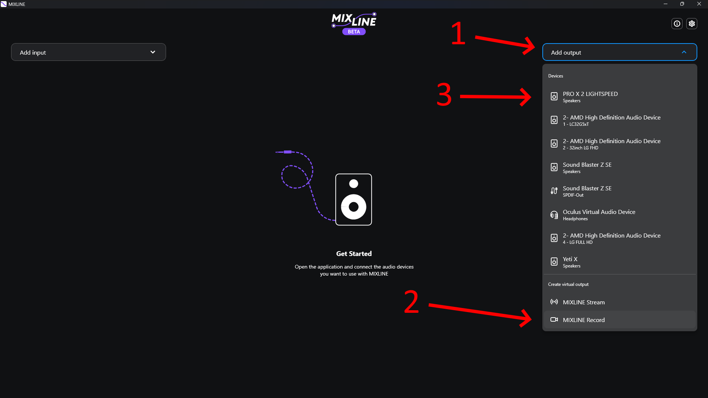
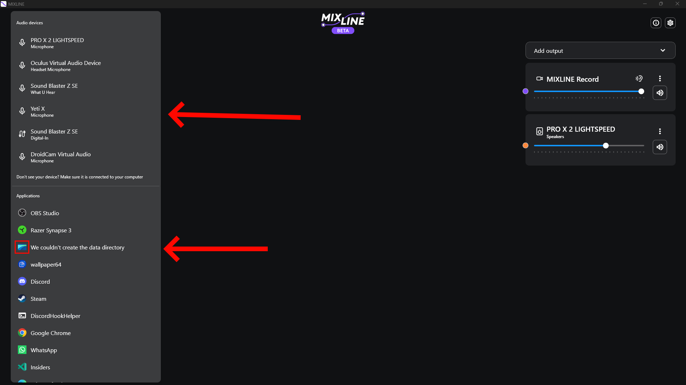
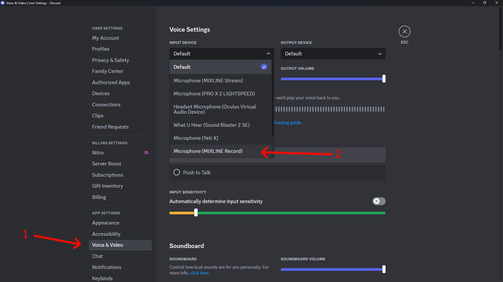

# nSoundboard by DNA

Hey, this is a small application I made at 4 AM in the morning, which is just a simple soundboard which uses a [Deno](https://deno.land/) webserver for the backend and a [Tauri](https://tauri.app/) frontend.

## How to use

- Put your sound and thumbnail files in the `client`-folder. Example:

|                         |                   |
| ----------------------- | ----------------- |
| `client/klingeling.mp3` | -> Sound file     |
| `client/klingeling.png` | -> Thumbnail file |

- Other file formats will not be recognized by the application
- Run the backend using `deno run -A main.ts`. The webserver __is not required to run on the same device as the frontend!__
- In `frontend/index.html`, line 7, change the IP address to what your device is running on, usually `localhost`. The default port is `8000
- Install dependencies by running `npm install` and installing [Rust](https://www.rust-lang.org/learn/get-started)
- Compile the frontend using `npm run tauri build`
- Run the newly generated `frontend/src-tauri/target/release/soundboard-daemon.exe`
- The frontend is completely invisible, so it doesnt bother you
- Now, on your browser navigate to the webserver (by default http://localhost:8000) and you should see the soundboard, or a black screen, if there are no sounds yet
- Just simply click on the thumbnail to play the sound

## Playing the sounds on your microphone using Logitech MixLine
- First, install the [Logitech MixLine Beta](https://www.logitechg.com/en-us/software/mixline.html)
- When MixLine is installed, create a new virtual output device (which will be your new microphone) and also add your normal speakers

- Now, add the application with the  Microsoft Edge Webview icon and your normal microphone

- Then, pull both inputs to the `MIXLINE Record` (or `Stream`) output

- Lastly, in the application, where you want to use the soundboard, use the `MIXLINE Record` (or `Stream`) as your microphone

- And now, enjoy your soundboard!